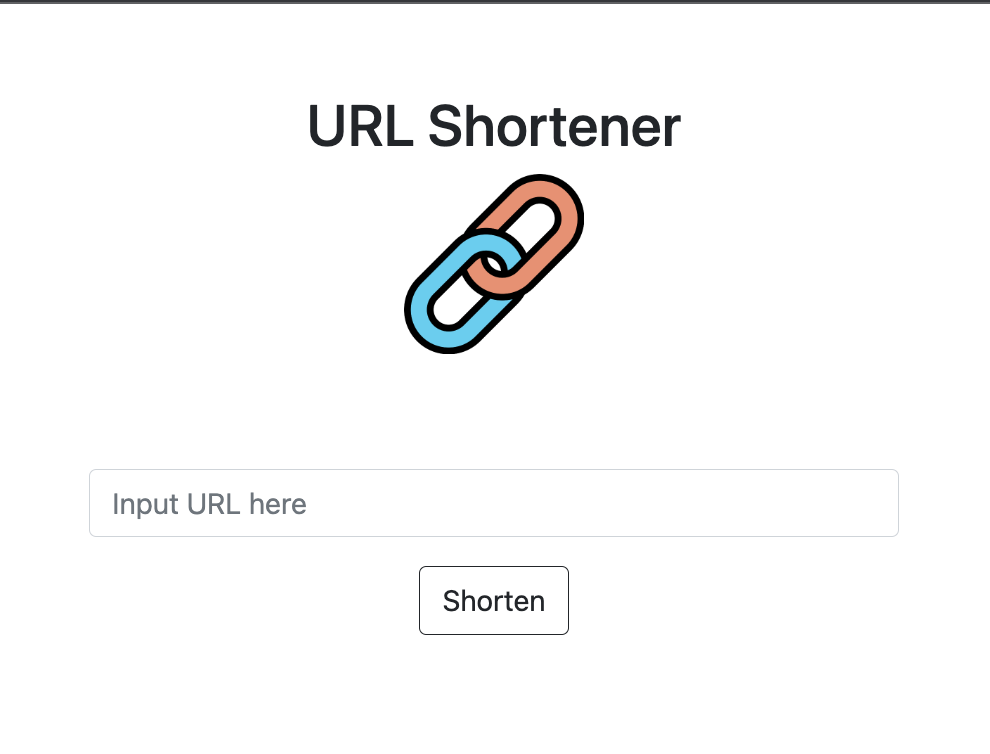

# URL Shortener 短網址產生器
將長網址轉換成短網址




## 功能描述 Features

* 輸入網址能轉換成短網址
* 透過短網址可以連結到原網址


## 安裝與執行步驟 Installation and Execution
1. 請先確認有安裝 Node.js 與 npm
2. 打開終端機(Terminal)，將專案 clone 至本機位置

```
git clone https://github.com/abbie930/URL_shortener.git
```
3. 進入存放此專案的資料夾

```
cd URL_shortener
```
4. 安裝 npm 套件

```
npm install
```
5. 安裝完成後，輸入

```
npm run start
```
6. 若看見此行訊息則代表順利運行，打開瀏覽器進入到以下網址

```
Express is listening on http://localhost:3000
```


## 環境建置與需求 Prerequisites

* Node.js 18.12.1
* Express 4.18.2
* Express-Handlebars 6.0.6
* Bootstrap 5.0.2
* MongoDB
* mongoose 6.8.1